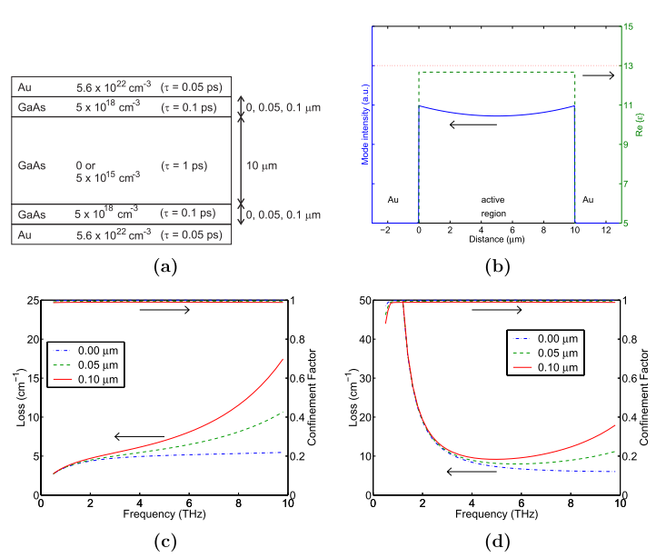
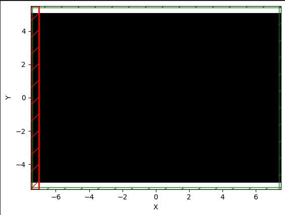
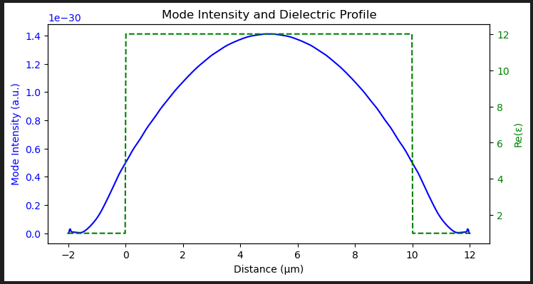
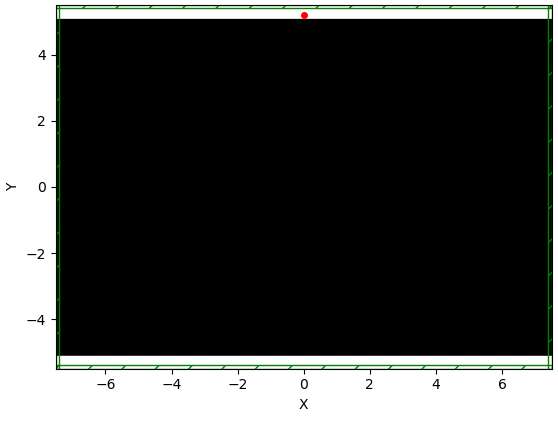

# Research on aperiodic lattice laser 
## logs

### 7.14  

> Define the materials in the QCL_Materials.py.  
 The parameters are given by the Chat, based on the Drude model.  
 Try to make the reappearance of 4.5.1 Plasmon waveguide in   
https://dspace.mit.edu/bitstream/handle/1721.1/17012/54455783-MIT.pdf?sequence=2&isAllowed=y
   
 The code is in the Reappearance.py, please put the QCL_materials.py together to run the script.  
 >The structure is as following , the red section is the source.  
   
  The result is record as following.  
 
 It seems the source can not transport through the materials.

 ### 7.16
 > Previous sourcs is setting from the x axis  
 Try source from direction of y axis with the dot source  
 The structure is as following, the red dot is a continuous source with frequency of 3THz.  
   
The result is as following.  
