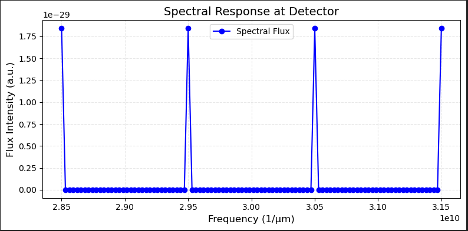

# Research on aperiodic lattice laser 
## logs

### 7.14  

> Define the materials in the QCL_Materials.py.  
 The parameters are given by the Chat, based on the Drude model.  
 Try to make the reappearance of 4.5.1 Plasmon waveguide in   
https://dspace.mit.edu/bitstream/handle/1721.1/17012/54455783-MIT.pdf?sequence=2&isAllowed=y
   
 The code is in the Reappearance.py, please put the QCL_materials.py together to run the script.  
 The result is record as following.  
   
 Also there are some figures about the structure and flux.  
 
   
 It seems the source can not transport through the materials.

 ### 7.15