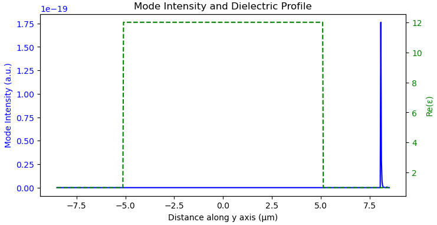
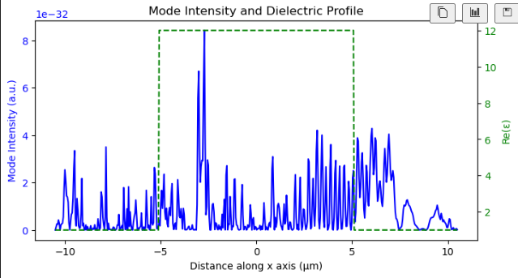
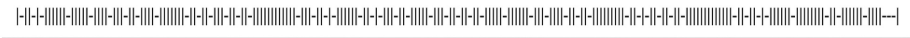
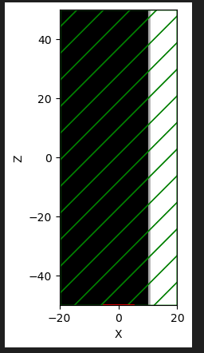

# Research on aperiodic lattice laser 
## logs

### 7.14  

> Define the materials in the QCL_Materials.py.  
 The parameters are given by the Chat, based on the Drude model.  
 Try to make the reappearance of 4.5.1 Plasmon waveguide in   
https://dspace.mit.edu/bitstream/handle/1721.1/17012/54455783-MIT.pdf?sequence=2&isAllowed=y
   
 The code is in the Reappearance.py, please put the QCL_materials.py together to run the script.  
 >The structure is as following , the red section is the source.  
   
  The result is record as following.  
 
 It seems the source can not transport through the materials.

 ### 7.16
 > Previous sourcs is setting from the x axis  
 Try source from direction of y axis with the dot source  
 The structure is as following, the red dot is a continuous source with frequency of 3THz.  
   
The result is as following.  

### 7.18
> Modify the direction from z axis with 3THz and observe the intensity from x axis and result is as follows.  
Source is setted up as a slab continuous source.  
The structure is below.  
  
Au thickness is 0.1 um and active region is 10 um.  
Simulation is run without pml layer in 3D.  
  
The materials is using the parameter in meep.  

### 7.23
> Back to the structure of QCL like below.  
  
The grating is the same as below.  
  
sim plot is as below.  
  
The result of ez is like this.  
  
code is in  QCL_Lab_723.py  
