# Research on aperiodic lattice laser 
## logs

---
### 7.14  
- Define the materials in the QCL_Materials.py.  
- The parameters are given by the Chat, based on the Drude model.  
- Try to make the reappearance of 4.5.1 Plasmon waveguide in   
https://dspace.mit.edu/bitstream/handle/1721.1/17012/54455783-MIT.pdf?sequence=2&isAllowed=y
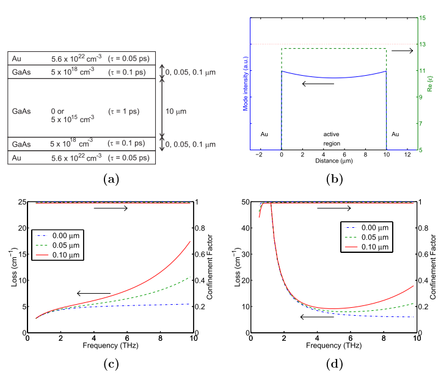   
- The code is in the Reappearance.py, please put the **QCL_materials.py** together to run the script.  
- The structure is as following , the red section is the source.  
 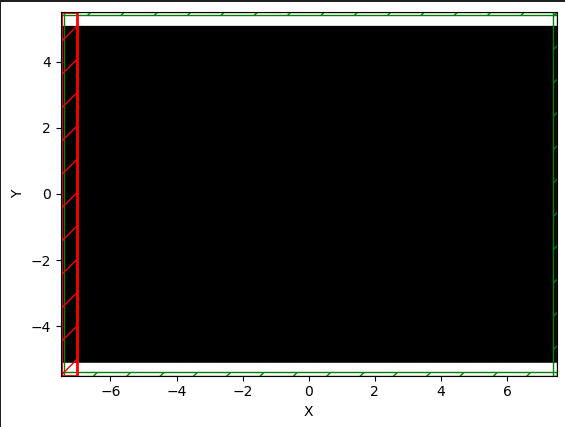  
- The result is record as following.  
 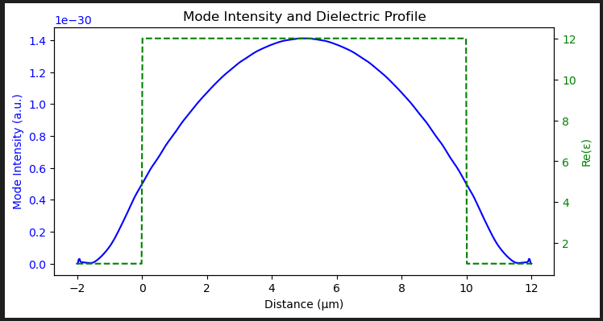
- It seems the source can not transport through the materials.
---
 ### 7.16
- Previous sourcs is setting from the x axis  
- Try source from direction of y axis with the dot source  
- The structure is as following, the red dot is a continuous source with frequency of 3THz.  
 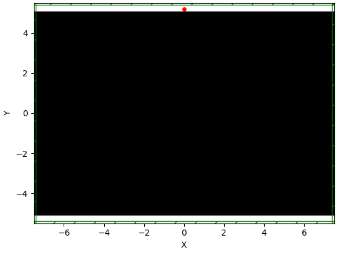  
- The result is as following.  
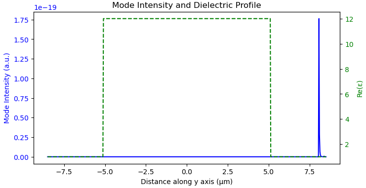
---
### 7.18
- Modify the direction from z axis with 3THz and observe the intensity from x axis and result is as follows.  
- Source is setted up as a slab continuous source.  
- The structure is below.  
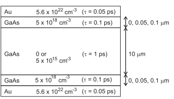  
- Au thickness is 0.1 um and active region is 10 um.  
- Simulation is run without pml layer in 3D.  
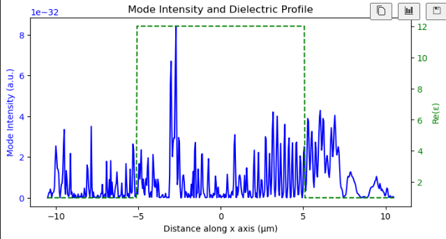  
- The materials is using the parameter in meep.  
---
### 7.23
- Back to the structure of QCL like below.  
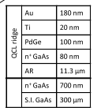  
- The grating is the same as below.  
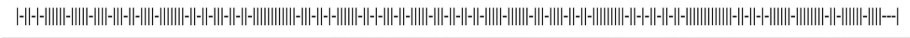  
- sim plot is as below.  
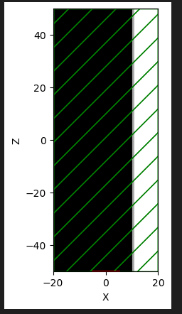  
- The result of ez is like this.  
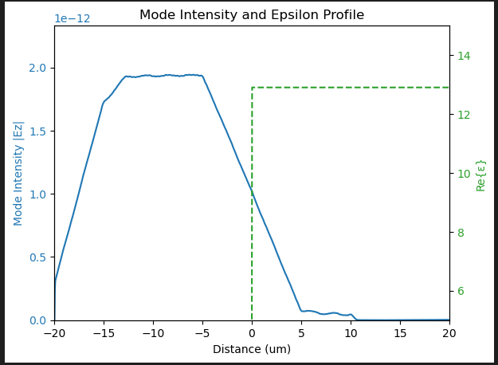  
- code is in  QCL_Lab_723.py  

### 7.24
- Try to reappear the metal-metal waveguide with gold.  
- Set up source as continuous source and will end at 10s.  
- The parameter of material is set as follows, using the drude model.  
~~~python
Au = mp.Medium(
    epsilon=1.0,
    E_susceptibilities=[
        mp.DrudeSusceptibility(
            frequency=5.0,
            gamma=0.5,    
            sigma=1.0)])

# N = 5e18
# n_GaAs = mp.Medium(epsilon=12.25)
n_GaAs = mp.Medium(
    epsilon=10.9,
    E_susceptibilities=[
        mp.DrudeSusceptibility(frequency=0.44, gamma=0.033, sigma=1.0)])

# N = 5e15 低参杂
light_GaAs = mp.Medium(epsilon=12.25)
# light_GaAs = mp.Medium(
#     epsilon=12.25,
#     E_susceptibilities=[
#         mp.DrudeSusceptibility(frequency=0.062, gamma=0.0033, sigma=1.0)])

nplus_GaAs = mp.Medium(
    epsilon=10.9,  
    E_susceptibilities=[
        mp.DrudeSusceptibility(
            frequency=0.1967,   # Plasma resonant frequency
            gamma=0.0333,       # damping constant
            sigma=1.0           # conductivity
        )
    ]
)
~~~
- Result is as follows.    
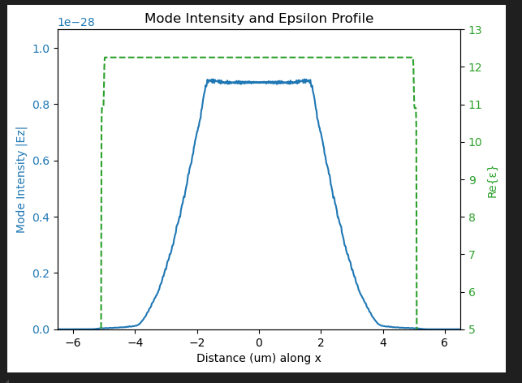   
- The frequency of source is set as 5THz.  
- Code is in the **Metal-metal_wg_0724.py**.  

### 7.25
- Recalculate the parameter of drude model for there is something wrong in the previous version.
- Code is in the **calculate_drude.py**.
~~~python
# Au = mp.Medium(
#     epsilon=1.0,
#     E_susceptibilities=[
#         mp.DrudeSusceptibility(
#             frequency=5.0,
#             gamma=0.5,    
#             sigma=1.0)])

# N = 5e18 /cm3
# n_GaAs = mp.Medium(epsilon=12.25)
n_GaAs = mp.Medium(
    epsilon=10.9,
    E_susceptibilities=[
        mp.DrudeSusceptibility(frequency=1.62, 
                               gamma=0.033, 
                               sigma=1.0)])

# N = 5e15 /cm3
# light_GaAs = mp.Medium(epsilon=12.25)
light_GaAs = mp.Medium(
    epsilon=12.25,
    E_susceptibilities=[
        mp.DrudeSusceptibility(frequency=0.0513, 
                               gamma=0.0033, 
                               sigma=1.0)])

# N = 1e18 /cm3
nplus_GaAs = mp.Medium(
    epsilon=10.9,  
    E_susceptibilities=[
        mp.DrudeSusceptibility(
            frequency=0.7252,   # Plasma resonant frequency
            gamma=0.0333,       # damping constant
            sigma=1.0           # conductivity
        )
    ]
)
~~~
- Simulation code is in the **MM_wg_modified_0725.py**.
- You can also see the result in **MM_wg_modified_0725.ipynb**.
- Introduction of the code is in the **Intro_MM_0725.md**.
